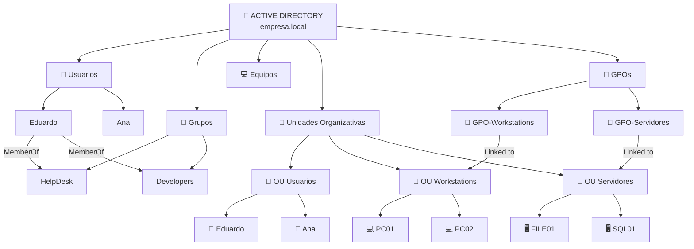
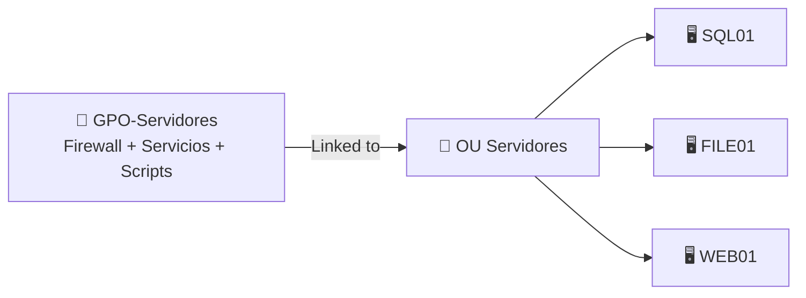

# Estructura básica de Active Directory

Active Directory organiza distintos tipos de objetos dentro de un dominio. Los más importantes para entender su estructura son:

* Usuarios
* Equipos
* Grupos
* Unidades Organizativas u OU
* GPO



## Usuarios, equipos y grupos

Los usuarios y los equipos son objetos individuales dentro de Active Directory.

Después existen los **grupos**, que permiten reunir diferentes objetos mediante relaciones de membresía.

Por ejemplo:

```text
Eduardo
├── MemberOf → HelpDesk
└── MemberOf → Developers
```

Pertenecer a un grupo no significa necesariamente obtener permisos automáticamente.

Lo que ocurre es que otros recursos pueden conceder permisos al grupo.

Por ejemplo:

```text
PC01
→ HelpDesk puede actuar como administrador

FILE01
→ HelpDesk puede acceder a una carpeta
```

Si Eduardo pertenece a `HelpDesk`, hereda indirectamente esas capacidades.

---

## Unidades Organizativas

Las **OU** sirven principalmente para organizar los objetos dentro de Active Directory.

Por ejemplo:

```text
OU Usuarios
├── Eduardo
└── Ana

OU Workstations
├── PC01
└── PC02

OU Servidores
├── FILE01
└── SQL01
```

Una OU puede contener:

```text
usuarios
equipos
grupos
otras OUs
```

Pero una OU no es lo mismo que un grupo.

La diferencia más sencilla es:

```text
GRUPO
→ membresía
→ permisos / roles

OU
→ ubicación y organización
→ administración
→ ámbito de GPOs
```

Por ejemplo:

```text
Eduardo
├── ubicado en → OU Usuarios
└── MemberOf → HelpDesk
```

Son dos relaciones completamente diferentes.

---

# GPO

Las **Group Policy Objects** son conjuntos de configuraciones centralizadas que Active Directory puede aplicar a usuarios y equipos.

Una GPO puede configurar, por ejemplo:

```text
Firewall
servicios
scripts
registro
fondo de escritorio
restricciones
Administrador de tareas
configuraciones de seguridad
```

Normalmente se vinculan a:

```text
Site
Domain
OU
```

No se vinculan directamente a un usuario individual o a un grupo como mecanismo normal de aplicación.

Ejemplo:



La interpretación sería:

```text
GPO-Servidores
       ↓
OU Servidores
       ↓
SQL01
FILE01
WEB01
```

Los equipos ubicados dentro de esa OU pueden recibir las configuraciones de la GPO.

---

# GPO y grupos

Aquí aparece una diferencia importante.

Una GPO **no entra dentro de un grupo para buscar a sus miembros**.

Ejemplo:

```text
OU Informática
├── Eduardo
├── Ana
└── HelpDesk
```

Si la GPO está vinculada a `OU Informática`, puede afectar a Eduardo y Ana porque sus objetos están ubicados dentro de esa OU.

Pero si Pedro está en otra OU:

```text
OU Ventas
└── Pedro
```

y además:

```text
Pedro
↓ MemberOf
HelpDesk
```

Pedro no recibe automáticamente la GPO de `OU Informática` simplemente por pertenecer a `HelpDesk`.

La GPO no sigue las relaciones `MemberOf`.

---

## Security Filtering

Los grupos sí pueden utilizarse posteriormente para **filtrar quién recibe una GPO**.

Por ejemplo:

```text
GPO-Informática
↓
Linked to → OU Informática

OU Informática
├── Eduardo → HelpDesk
├── Ana → Developers
└── Juan → HelpDesk

Security Filtering
→ HelpDesk
```

Resultado:

```text
Eduardo ✅
Juan    ✅
Ana     ❌
```

Primero la OU determina el ámbito de la GPO.

Después el Security Filtering puede restringir qué objetos dentro de ese ámbito terminan aplicándola.

---

# Conclusión

La estructura básica puede entenderse así:

```text
USUARIO / EQUIPO
      │
      ├── está ubicado en una OU
      │        ↓
      │   organización + GPO
      │
      └── pertenece a grupos
               ↓
          permisos / roles
```

Y por otro lado:

```text
GPO
 ↓
Site / Domain / OU
 ↓
usuarios y equipos del ámbito
 ↓
Security Filtering opcional
 ↓
configuración aplicada
```

La idea más importante es no confundir:

> **Grupo = membresía y permisos.**
> **OU = ubicación y organización.**
> **GPO = configuración centralizada.**

Esta base es la que después permite entender correctamente **BloodHound, ACL Abuse y GPO Abuse**.
