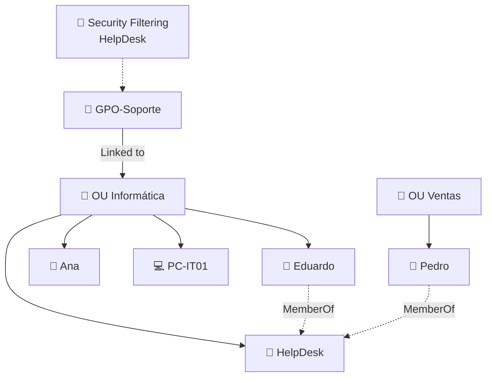

Sí, **como modelo mental simplificado, sí**.

Solo cambiaría “escritos explícitamente” por **“cuyo objeto está ubicado dentro de esa OU —o de una OU hija que herede la GPO—”**.

La idea es:

> **La GPO no abre los grupos para buscar miembros. Primero tiene un ámbito formado por usuarios/equipos según su ubicación en AD; después Security Filtering puede comprobar, por ejemplo, si esos usuarios/equipos pertenecen a un grupo.**

Intenta interpretar este:

Ahora dime tú:

1. ¿Quién está **dentro del ámbito** de la GPO?
2. ¿A quién podría afectar finalmente si el filtro es `HelpDesk`?
3. ¿Le afectaría a Pedro por pertenecer a `HelpDesk` aunque esté en `OU Ventas`?

Ahí se ve exactamente si ya ha quedado fijada la diferencia.
