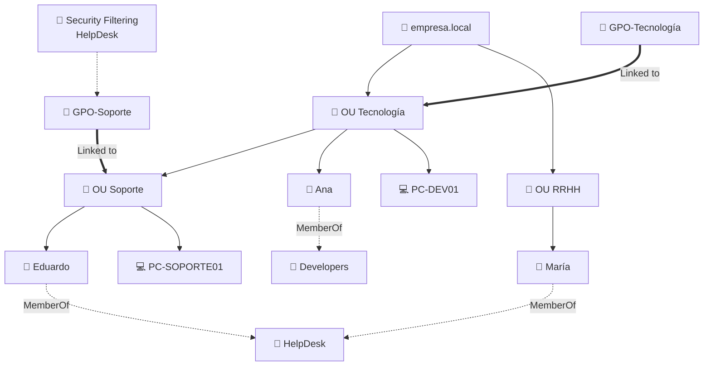

Claro. Te pongo otro, esta vez con **dos OUs, una OU hija y dos GPOs**, para que tenga un poco más de trampa.

Intenta decirme:

1. ¿Quién entra en el ámbito de `GPO-Tecnología`?
2. ¿Quién entra en el ámbito de `GPO-Soporte`?
3. ¿A quién terminaría afectando `GPO-Soporte` con el filtro `HelpDesk`?
4. ¿María recibe `GPO-Soporte` por pertenecer a `HelpDesk`?
5. ¿Eduardo recibe también `GPO-Tecnología` por estar dentro de una OU hija de `OU Tecnología`?

Aquí ya entra una idea nueva importante: **las GPO pueden heredarse hacia OUs hijas**.
