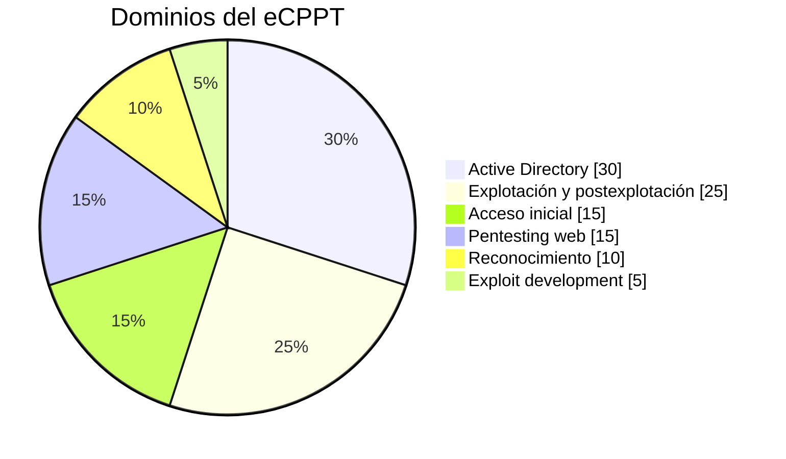
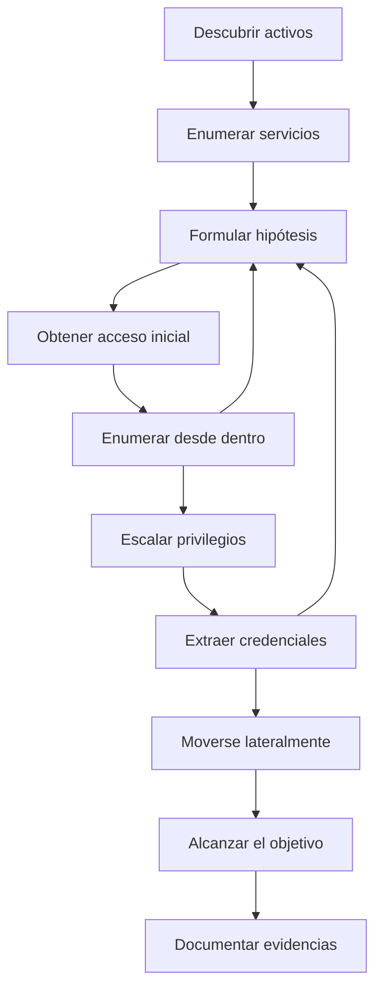

# eCPPT: guía completa de preparación

Este repositorio convierte los objetivos actuales del **eCPPT (Certified Professional Penetration Tester)** en un itinerario de aprendizaje práctico. Está escrito para una persona que ya ha aprobado el eJPT: se asume que ha visto redes, enumeración, Metasploit, explotación básica y pivoting, pero no que domine Active Directory, Kerberos, escalada de privilegios o explotación manual.

El objetivo no es memorizar comandos. El objetivo es poder entrar en una red desconocida, construir un mapa fiable, obtener acceso inicial, elevar privilegios, reutilizar credenciales, atravesar segmentos y explicar por qué funcionó cada paso.

> Todo el contenido práctico está pensado exclusivamente para laboratorios propios, CTF, plataformas autorizadas y auditorías con permiso expreso.

## Peso actual del examen

## Cómo está organizado

| Bloque | Qué aporta |
|---|---|
| [00-Introduccion](00-Introduccion/README.md) | Mapa del examen, flujo completo y prioridades |
| [01-Conceptos-esenciales](01-Conceptos-esenciales/README.md) | Modelos mentales: AD, Kerberos, hashes, tickets, pivoting y web |
| [02-Herramientas](02-Herramientas/README.md) | Qué resuelve cada herramienta, cuándo usarla y ejemplos |
| [03-Temario](03-Temario/README.md) | Contenido de cabo a rabo, ordenado por los dominios oficiales |
| [04-Laboratorios](04-Laboratorios/README.md) | Prácticas progresivas y un laboratorio final encadenado |
| [05-Chuletas](05-Chuletas/README.md) | Listas de comprobación y comandos para repasar |
| [06-Plan-de-estudio](06-Plan-de-estudio/README.md) | Ruta de 14 semanas y criterios de dominio |
| [07-Glosario](07-Glosario/README.md) | Definiciones rápidas conectadas entre sí |
| [COBERTURA-OFICIAL.md](COBERTURA-OFICIAL.md) | Trazabilidad entre cada objetivo de INE y el material |
| [FUENTES.md](FUENTES.md) | Documentación oficial y referencias técnicas |

## La idea central

La enumeración reaparece continuamente. Después de cada credencial, shell, equipo o privilegio nuevo, se vuelve a enumerar. En una intrusión realista, la información es la que abre el camino; la explotación solo materializa una hipótesis.

## Regla de dominio

Un tema se considera aprendido cuando puedes:

1. Explicarlo sin nombrar primero una herramienta.
2. Reconocer qué datos de entrada necesita.
3. Ejecutarlo en un laboratorio autorizado.
4. Interpretar tanto un resultado positivo como uno negativo.
5. Proponer una alternativa si falla.
6. Explicar el impacto y la mitigación.

No des por terminado un bloque porque hayas visto todos sus vídeos. Termínalo cuando puedas resolver una práctica nueva sin seguir una receta.

